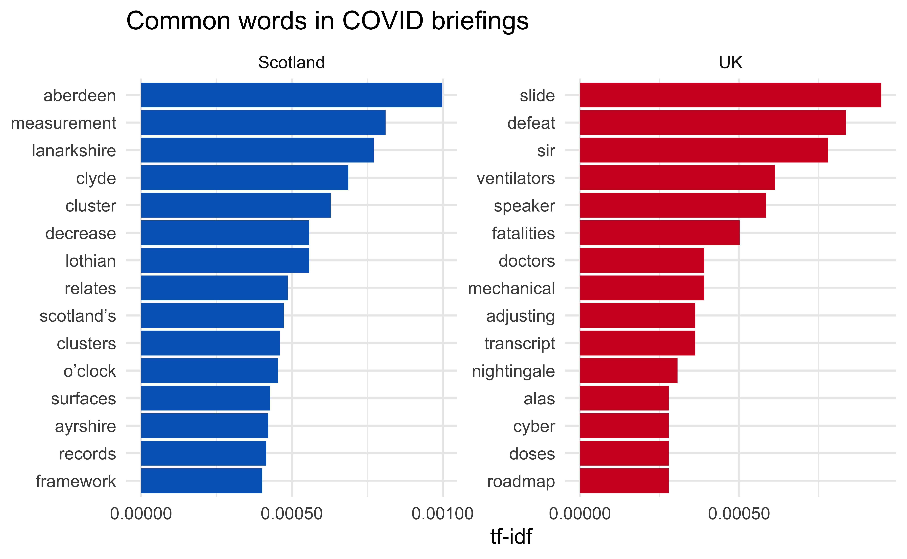

06-visualise-compare
================
2020-11-29

``` r
covid_speeches_scot_words <- covid_speeches_scot_words %>%
  mutate(origin = "Scotland")

covid_speeches_uk_words <- covid_speeches_uk_words %>%
  mutate(origin = "UK")
```

``` r
covid_speeches_words <- covid_speeches_scot_words %>%
  select(-location, -speaker) %>% # uk data doesn't have these
  bind_rows(covid_speeches_uk_words)
```

## Basic comparison

More speeches in Scotland than UK and longer on average.

``` r
covid_speeches_words %>%
  group_by(origin) %>%
  summarise(
    n_speeches = max(speech_no),
    n_words    = n(),
    avg_words  = n_words / n_speeches
    )
```

    ## `summarise()` has ungrouped output. You can override using the `.groups` argument.

    ## # A tibble: 2 x 4
    ##   origin   n_speeches n_words avg_words
    ## * <chr>         <int>   <int>     <dbl>
    ## 1 Scotland        157  106933      681.
    ## 2 UK               55   24903      453.

``` r
covid_speeches_words %>%
  distinct(origin, speech_no, .keep_all = TRUE) %>%
  ggplot(aes(x = n_words, color = origin, fill = origin)) +
  geom_density(alpha = 0.7) +
  scale_color_manual(values = c(scotblue, ukred)) +
  scale_fill_manual(values = c(scotblue, ukred)) +
  labs(
    x = "Number of words",
    y = "Density",
    color = "Origin", fill = "Origin"
  ) +
  theme(axis.text.y = element_blank())
```


## TF-IDF

Calculate tf-idf

``` r
covid_speeches_tf_ifd <- covid_speeches_words %>%
  count(origin, word, sort = TRUE) %>%
  group_by(origin) %>%
  mutate(total = sum(n)) %>%
  bind_tf_idf(word, origin, n)
```

View words with high TF-IDF

``` r
covid_speeches_tf_ifd %>%
  select(-total) %>%
  arrange(desc(tf_idf))
```

    ## # A tibble: 11,130 x 6
    ## # Groups:   origin [2]
    ##    origin   word            n       tf   idf   tf_idf
    ##    <chr>    <chr>       <int>    <dbl> <dbl>    <dbl>
    ##  1 Scotland aberdeen      154 0.00144  0.693 0.000998
    ##  2 UK       slide          34 0.00137  0.693 0.000946
    ##  3 UK       defeat         30 0.00120  0.693 0.000835
    ##  4 Scotland measurement   125 0.00117  0.693 0.000810
    ##  5 UK       sir            28 0.00112  0.693 0.000779
    ##  6 Scotland lanarkshire   119 0.00111  0.693 0.000771
    ##  7 Scotland clyde         106 0.000991 0.693 0.000687
    ##  8 Scotland cluster        97 0.000907 0.693 0.000629
    ##  9 UK       ventilators    22 0.000883 0.693 0.000612
    ## 10 UK       speaker        21 0.000843 0.693 0.000585
    ## # … with 11,120 more rows

Visualise TF-IDF

``` r
covid_speeches_tf_ifd %>%
  arrange(desc(tf_idf)) %>%
  mutate(word = factor(word, levels = rev(unique(word)))) %>% 
  group_by(origin) %>% 
  top_n(15) %>% 
  ungroup() %>%
  ggplot(aes(y = word, x = tf_idf, fill = origin)) +
  geom_col(show.legend = FALSE) +
  labs(y = NULL, x = "tf-idf", title = "Common words in COVID briefings") +
  facet_wrap(~origin, ncol = 2, scales = "free") +
  scale_fill_manual(values = c(scotblue, ukred)) +
  scale_x_continuous(breaks = c(0, 0.0005, 0.001), labels = label_number())
```

    ## Selecting by tf_idf


