06-visualise-uk
================
2021-04-21

## Length of speech

``` r
ggplot(covid_speeches_uk, aes(x = n_words)) +
  geom_density(color = ukred, fill = ukred, alpha = 0.5) +
  labs(
    title = "Distribution of number of words",
    subtitle = "of UK daily briefings",
    x = "Number of words",
    y = "Density"
  ) +
  theme(axis.text.y = element_blank())
```

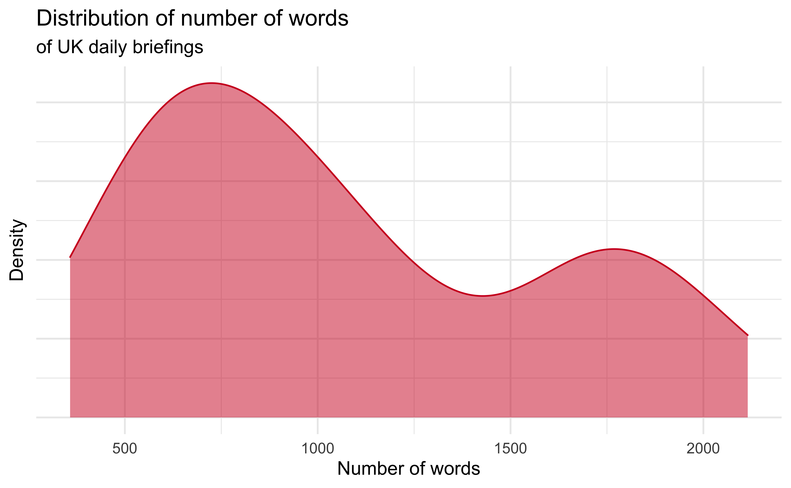

``` r
lm_words <- lm(n_words ~ date, data = covid_speeches_uk)
lm_words_rsq <- glance(lm_words)$r.squared

covid_speeches_uk %>%
  ggplot(aes(x = date, y = n_words)) +
  geom_point(color = ukred, alpha = 0.7) +
  geom_smooth(aes(x = date, y = n_words), method = lm, formula = y ~ x, color = "darkgray") +
  labs(
    title = "Length of UK COVID-19 speeches",
    subtitle = glue("Measured in number of words, R-squared = {percent(lm_words_rsq)}"),
    x = NULL, y = "Number of words", color = NULL, shape = NULL
  )
```

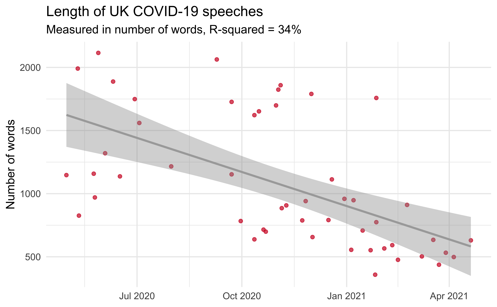

## Remove stop words

``` r
covid_speeches_uk_words <- covid_speeches_uk_words %>%
  anti_join(stop_words)
```

    ## Joining, by = "word"

## Word frequency

``` r
threshold <- 75

covid_speeches_uk_words %>%
  count(word, sort = TRUE) %>%
  filter(n > threshold) %>%
  ggplot(aes(y = fct_reorder(word, n), x = n, fill = n)) +
  geom_col() +
  guides(fill = FALSE) +
  labs(
    title = "Frequency of words in UK COVID-19 briefings",
    subtitle = glue("Words occurring more than {threshold} times"),
    y = NULL, x = NULL
  )
```

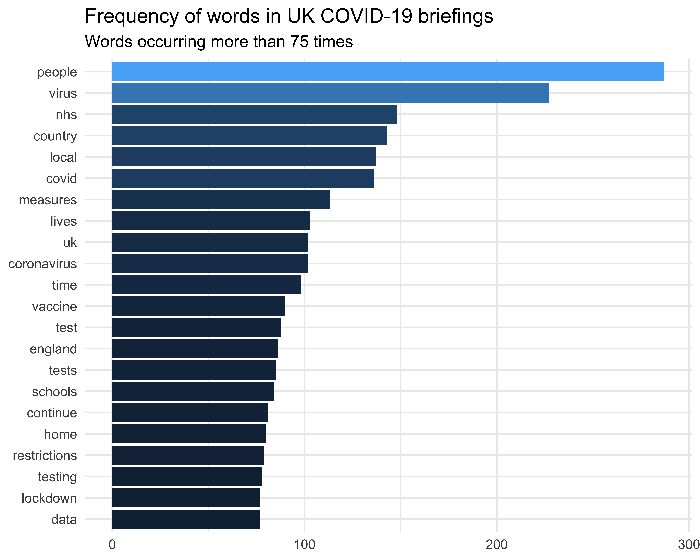

## Sentiment analysis

“positive” isn’t really a positive word in this context. Remove and plot
again.

``` r
covid_speeches_uk_words %>%
  filter(word != "positive") %>%
  inner_join(get_sentiments("bing"), by = "word") %>%
  count(sentiment, word, sort = TRUE) %>%
  group_by(sentiment) %>%
  slice_head(n = 20) %>%
  ggplot(aes(y = fct_reorder(word, n), x = n, fill = sentiment)) +
  geom_col() +
  guides(fill = FALSE) +
  facet_wrap(~sentiment, scales = "free") +
  labs(
    title = "Sentiment and frequency of words in UK COVID-19 briefings",
    subtitle = "Bing lexicon",
    y = NULL, x = NULL
  ) +
  scale_fill_manual(values = c(light_red, light_blue))
```

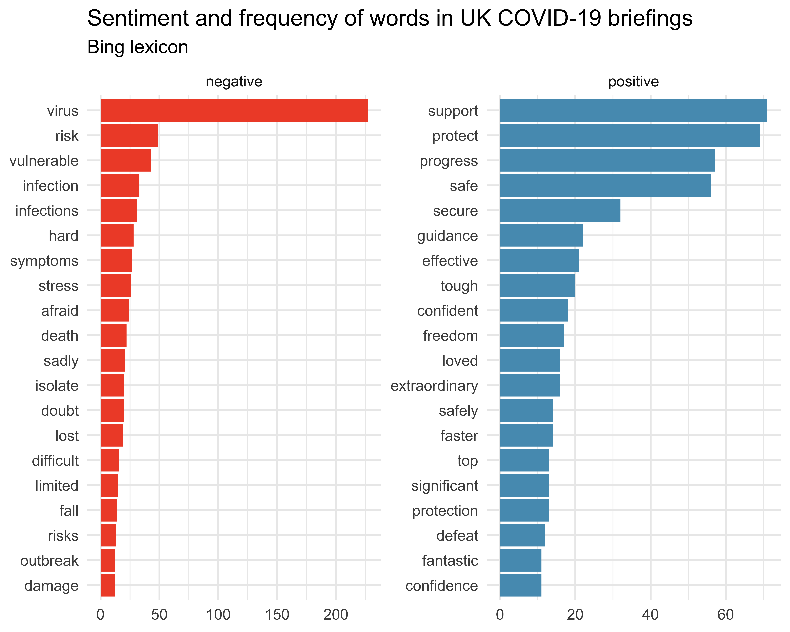

## Briefing sentiments

### Lexicon: Bing

Sentiments: Positive and negative.

``` r
covid_speeches_uk_words %>%
  filter(word != "positive") %>%
  inner_join(get_sentiments("bing"), by = "word") %>%
  count(date, sentiment) %>%
  pivot_wider(names_from = sentiment, values_from = n) %>%
  mutate(sentiment = positive - negative) %>%
  ggplot(aes(x = date, y = sentiment)) +
  geom_line(color = "gray") +
  geom_point(aes(color = sentiment > 0, shape = sentiment > 0), size = 2, alpha = 0.8, show.legend = FALSE) +
  geom_hline(yintercept = 0, linetype = "dashed", color = "lightgray") +
  labs(
    title = "Sentiment in UK COVID-19 briefings",
    subtitle = "Sentiment score calculated as the number of positive - the number of negative words in each briefing,\naccording to the Bing lexicon",
    x = "Date of briefing", y = "Sentiment score (positive - negative)",
    caption = "Data: gov.scot | Plot: @minebocek"
  ) +
  scale_color_manual(values = c(light_red, light_blue))
```

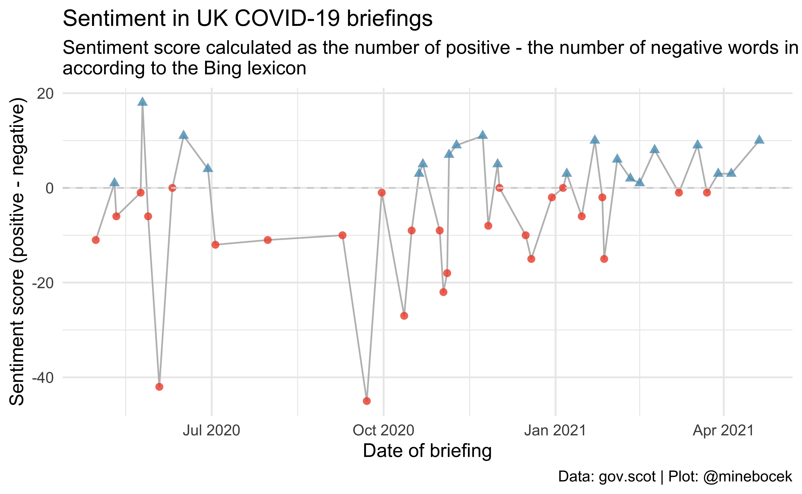

and now with a smooth curve…

``` r
covid_speeches_uk_words %>%
  filter(word != "positive") %>%
  inner_join(get_sentiments("bing"), by = "word") %>%
  count(date, sentiment) %>%
  pivot_wider(names_from = sentiment, values_from = n) %>%
  mutate(sentiment = positive - negative) %>%
  ggplot(aes(x = date, y = sentiment)) +
  geom_smooth(color = "gray", method = "loess", formula = y ~ x) +
  geom_point(aes(color = sentiment > 0, shape = sentiment > 0), size = 2, alpha = 0.8, show.legend = FALSE) +
  geom_hline(yintercept = 0, linetype = "dashed", color = "lightgray") +
  labs(
    title = "Sentiment in UK COVID-19 briefings",
    subtitle = "Sentiment score calculated as the number of positive - the number of negative words in each briefing,\naccording to the Bing lexicon",
    x = "Date of briefing", y = "Sentiment score (positive - negative)",
    caption = "Data: gov.scot | Plot: @minebocek"
  ) +
  scale_color_manual(values = c(light_red, light_blue))
```

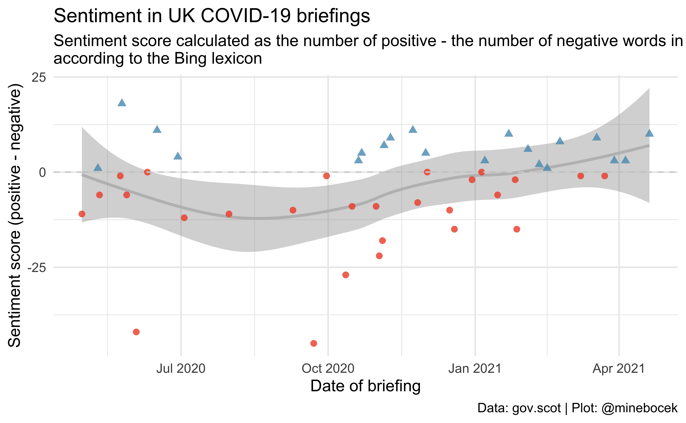

### Lexicon: NRC

Sentiments: rust, fear, negative, sadness, anger, surprise, positive,
disgust, joy, and anticipation.

``` r
covid_speeches_uk_words %>%
  filter(word != "positive") %>%
  inner_join(get_sentiments("nrc"), by = "word") %>%
  mutate(
    sentiment = fct_relevel(
      sentiment, "positive", "anticipation", "joy", "surprise", "trust",
      "negative", "anger", "disgust", "fear", "sadness"
    ),
    sentiment_binary = if_else(sentiment %in% c("positive", "anticipation", "joy", "surprise", "trust"), "positive", "negative")
  ) %>%
  count(sentiment_binary, sentiment, word, sort = TRUE) %>%
  group_by(sentiment) %>%
  slice_head(n = 10) %>%
  ggplot(aes(y = fct_reorder(word, n), x = n, fill = sentiment_binary)) +
  geom_col() +
  guides(fill = FALSE) +
  facet_wrap(~sentiment, scales = "free_y", ncol = 5) +
  labs(
    title = "Sentiment and frequency of words in UK COVID-19 briefings",
    subtitle = "NRC lexicon",
    y = NULL, x = NULL
  ) +
  scale_x_continuous(breaks = c(0, 200)) +
  theme_minimal(base_size = 11) +
  scale_fill_manual(values = c(light_red, light_blue))
```

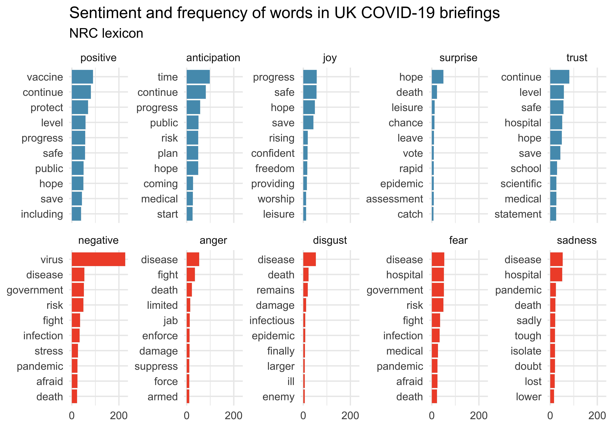

``` r
covid_speeches_uk_words %>%
  filter(word != "positive") %>%
  inner_join(get_sentiments("nrc"), by = "word") %>%
  mutate(
    sentiment = fct_relevel(
      sentiment, "positive", "anticipation", "joy", "surprise", "trust",
      "negative", "anger", "sadness", "disgust", "fear"
    ),
    sentiment_binary = if_else(sentiment %in% c("positive", "anticipation", "joy", "surprise", "trust"), "positive", "negative")
  ) %>%
  count(date, sentiment_binary, sentiment) %>%
  ggplot(aes(x = date, y = n, color = sentiment_binary)) +
  geom_line(size = 0.3) +
  guides(color = FALSE) +
  facet_wrap(~sentiment, ncol = 5) +
  labs(
    title = "Sentiment score of words in UK COVID-19 briefings over time",
    subtitle = "NRC lexicon",
    x = "Date", y = "Sentiment score", color = NULL
  ) +
  scale_color_manual(values = c(light_red, light_blue))
```

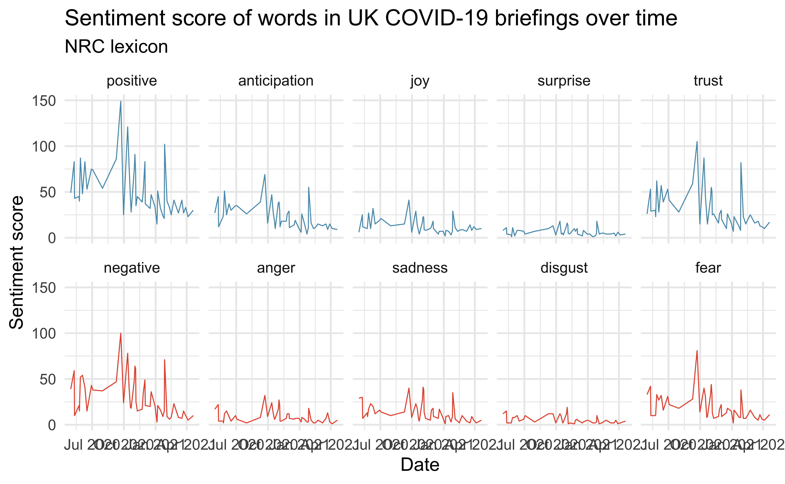

## Bigram frequency

``` r
threshold <- 15

covid_speeches_uk_bigrams %>%
  mutate(
    bigram = if_else(bigram == "care home", "care home(s)", bigram),
    bigram = if_else(bigram == "care homes", "care home(s)", bigram)
  ) %>%
  count(bigram, sort = TRUE) %>%
  filter(n > threshold) %>%
  ggplot(aes(y = fct_reorder(bigram, n), x = n, fill = n)) +
  geom_col() +
  guides(fill = FALSE) +
  labs(
    title = "Frequency of bigrams in UK COVID-19 briefings",
    subtitle = glue("Bigrams occurring more than {threshold} times"),
    y = NULL, x = NULL
  )
```

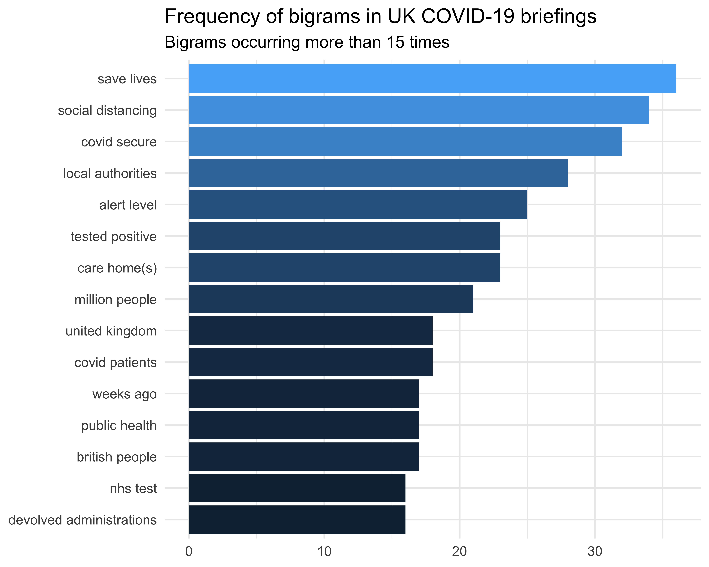

## Social vs. physical distancing

They never say physical distancing!

``` r
covid_speeches_uk %>%
  unnest_tokens(bigram, text, token = "ngrams", n = 2) %>%
  filter(str_detect(bigram, "social dist|physical dist")) %>%
  mutate(soc_phys = if_else(str_detect(bigram, "social"), "S", "P")) %>%
  count(date, soc_phys) %>%
  ggplot(aes(x = date, y = n, color = soc_phys)) +
  geom_text(aes(label = soc_phys)) +
  guides(color = FALSE) +
  labs(
    x = "Date", y = "Frequency",
    title = "Social (S) vs. physical (P) distancing",
    subtitle = "Number of mentions over time in UK briefings"
  ) +
  scale_color_manual(values = c(ukred, "darkgray")) +
  scale_y_continuous(limits = c(0, 6), breaks = seq(0, 6, 2))
```


## Vaccines

``` r
covid_speeches_uk_words %>%
  filter(str_detect(word, "[Vv]accin|\\b[Jj]abs?\\b")) %>%
  count(date) %>%
  ggplot(aes(x = date, y = n)) +
  geom_line(size = 0.3, color = "gray") +
  geom_smooth(size = 0.5, color = light_red, se = FALSE, span = 0.4) +
  geom_text(aes(label = "💉", size = n), show.legend = FALSE) +
  labs(
    x = "Date", y = "Frequency",
    title = "Number of times anything related to vaccination is mentioned in briefing",
    subtitle = "UK briefings"
  ) +
  expand_limits(y = 0)
```

    ## `geom_smooth()` using method = 'loess' and formula 'y ~ x'

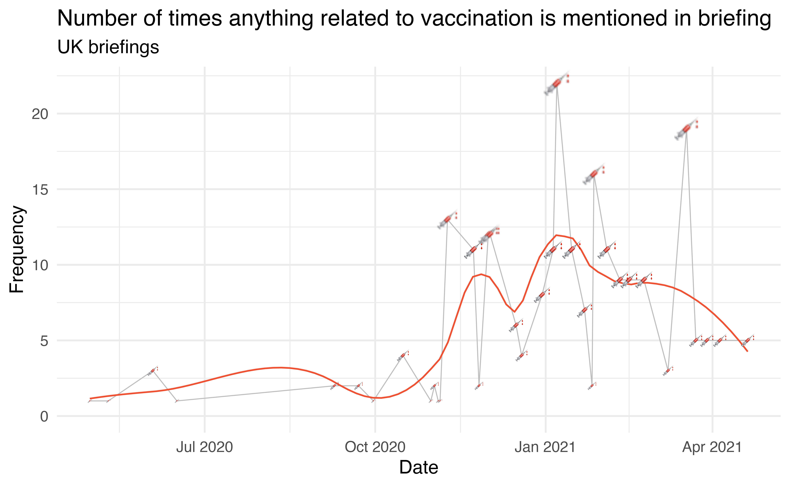

## Pubs

``` r
covid_speeches_uk_words %>%
  filter(str_detect(word, "\\b[Pp]ubs?\\b")) %>%
  count(date) %>%
  ggplot(aes(x = date, y = n)) +
  geom_line(size = 0.3, color = "gray") +
  geom_text(aes(label = "🍺", size = n, group = 1), show.legend = FALSE) +
  labs(
    x = "Date", y = "Frequency",
    title = 'Number of times "pub(s)" is mentioned in briefing',
      subtitle = "UK briefings"
  ) +
  expand_limits(y = c(0, 5))
```

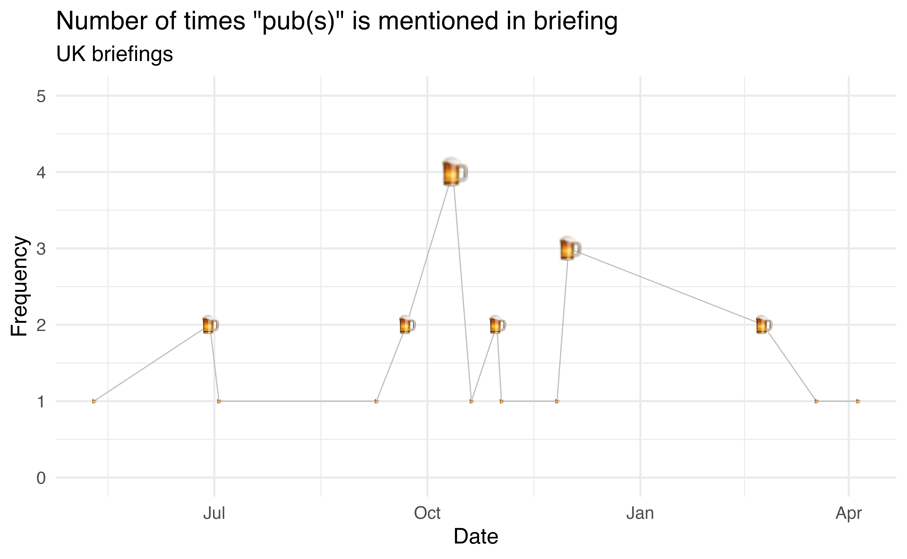
