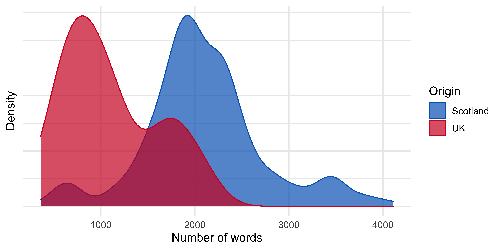

08-visualise-compare
================
2021-03-11

## Basic comparison

More speeches in Scotland than UK and longer on average.

``` r
covid_speeches_words %>%
  group_by(origin) %>%
  summarise(
    n_speeches = max(speech_no),
    n_words    = n(),
    avg_words  = n_words / n_speeches,
    .groups = "drop"
    )
```

    ## # A tibble: 2 x 4
    ##   origin   n_speeches n_words avg_words
    ## * <chr>         <int>   <int>     <dbl>
    ## 1 Scotland        204  422860     2073.
    ## 2 UK               40   43700     1092.

``` r
covid_speeches_words %>%
  distinct(origin, speech_no, .keep_all = TRUE) %>%
  ggplot(aes(x = n_words, color = origin, fill = origin)) +
  geom_density(alpha = 0.7) +
  scale_color_manual(values = c(scotblue, ukred)) +
  scale_fill_manual(values = c(scotblue, ukred)) +
  labs(
    x = "Number of words",
    y = "Density",
    color = "Origin", fill = "Origin"
  ) +
  theme(axis.text.y = element_blank())
```



## TF-IDF

The statistic tf-idf is intended to measure how important a word is to a
document in a collection (or corpus) of documents, for example, to one
novel in a collection of novels or to one website in a collection of
websites.[1]

Calculate tf-idf

``` r
covid_speeches_tf_ifd <- covid_speeches_words %>%
  count(origin, word, sort = TRUE) %>%
  group_by(origin) %>%
  mutate(total = sum(n)) %>%
  bind_tf_idf(word, origin, n)
```

View words with high TF-IDF

``` r
covid_speeches_tf_ifd %>%
  select(-total) %>%
  arrange(desc(tf_idf))
```

    ## # A tibble: 12,074 x 6
    ## # Groups:   origin [2]
    ##    origin   word            n       tf   idf   tf_idf
    ##    <chr>    <chr>       <int>    <dbl> <dbl>    <dbl>
    ##  1 Scotland registered    346 0.000818 0.693 0.000567
    ##  2 Scotland glasgow       217 0.000513 0.693 0.000356
    ##  3 UK       slide          21 0.000481 0.693 0.000333
    ##  4 UK       speaker        21 0.000481 0.693 0.000333
    ##  5 Scotland suspected     192 0.000454 0.693 0.000315
    ##  6 Scotland aberdeen      171 0.000404 0.693 0.000280
    ##  7 Scotland usual         171 0.000404 0.693 0.000280
    ##  8 Scotland measurement   168 0.000397 0.693 0.000275
    ##  9 Scotland issues        157 0.000371 0.693 0.000257
    ## 10 Scotland lanarkshire   144 0.000341 0.693 0.000236
    ## # … with 12,064 more rows

Visualise TF-IDF

``` r
covid_speeches_tf_ifd %>%
  arrange(desc(tf_idf)) %>%
  mutate(word = factor(word, levels = rev(unique(word)))) %>% 
  group_by(origin) %>% 
  slice_head(n = 15) %>% 
  ungroup() %>%
  ggplot(aes(y = word, x = tf_idf, fill = origin)) +
  geom_col(show.legend = FALSE) +
  labs(y = NULL, x = "tf-idf", title = "Common words in COVID briefings") +
  facet_wrap(~origin, ncol = 2, scales = "free") +
  scale_fill_manual(values = c(scotblue, ukred)) +
  scale_x_continuous(breaks = c(0, 0.00015, 0.0003), labels = label_number())
```


[1] Source: [Text Mining with
R](https://www.tidytextmining.com/tfidf.html)
