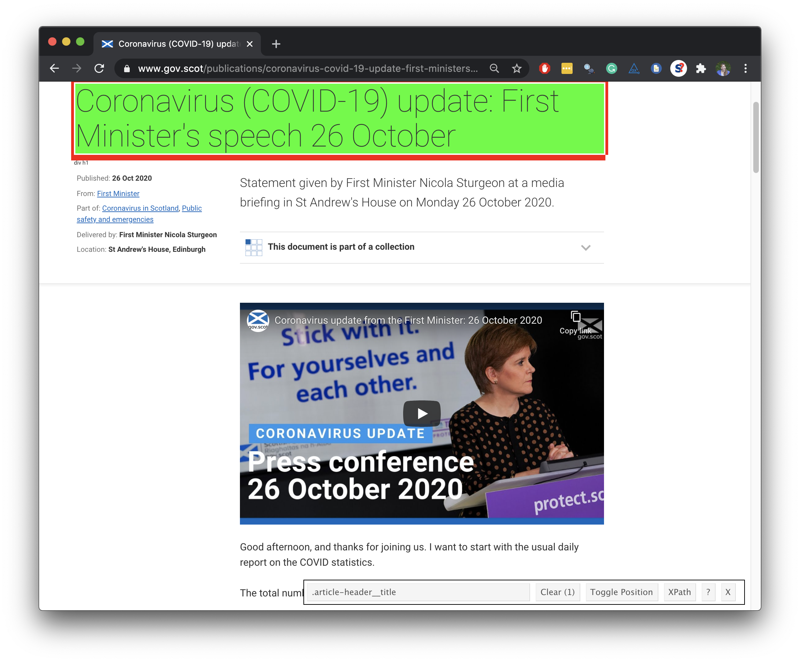

```{r packages, echo = FALSE, message=FALSE, warning=FALSE}
library(tidyverse)
library(tidymodels)
library(scales)
library(xaringanExtra)
library(knitr)
library(textrecipes)
library(themis)
library(vip)
library(glue)
```

```{r setup, include=FALSE}
# R options
options(
  htmltools.dir.version = FALSE,
  tibble.width = 65,
  width = 65
  )
# figure height, width, dpi
knitr::opts_chunk$set(echo = TRUE, 
                      fig.width = 8, 
                      fig.asp = 0.618,
                      out.width = "60%",
                      fig.align = "center",
                      dpi = 300,
                      message = FALSE)

# xaringanExtra
xaringanExtra::use_panelset()
```

## tidyverse 

.pull-left[
```{r echo=FALSE, out.width="80%"}
knitr::include_graphics("img/tidyverse.png")
```
]

.pull-right[
.center[.large[
[tidyverse.org](https://www.tidyverse.org/)
]]

- The **tidyverse** is an opinionated collection of R packages designed for data science
- All packages share an underlying philosophy and a common grammar
]

---

class: middle

```{r echo=FALSE, out.width="80%"}
knitr::include_graphics("img/tidyverse-packages.png")
```

---

## tidymodels

.pull-left[
```{r echo=FALSE, out.width="80%"}
knitr::include_graphics("img/tidymodels.png")
```
]

.pull-right[
.center[.large[
[tidymodels.org](https://www.tidymodels.org/)
]]

- The **tidymodels** framework is a collection of packages for modeling and machine learning using **tidyverse** principles.
- All packages share an underlying philosophy and a common grammar
]

---

class: middle

```{r echo=FALSE, out.width="90%"}
knitr::include_graphics("img/tidymodels-packages.png")
```

---

## Data science cycle

```{r echo=FALSE, out.width="80%"}
knitr::include_graphics("img/data-science.png")
```

.footnote[
[R for Data Science](https://r4ds.had.co.nz/introduction.html), Grolemund and Wickham.
]

---

class: middle

# Import

---

## 🏁 Start with

```{r echo=FALSE, out.width="75%"}

```

---

## End with 🛑

```{r echo=FALSE}
covid_speeches_scot <- read_rds(here::here("data/covid-speeches-scot.rds"))
covid_speeches_scot %>%
  print(n = 15)
```

---

#### .center[
[www.gov.scot/collections/first-ministers-speeches](https://www.gov.scot/collections/first-ministers-speeches/)
]

```{r echo=FALSE, out.width="75%"}
knitr::include_graphics("img/fm-speeches-annotated.png")
```

---

```{r echo=FALSE, out.width="65%"}
knitr::include_graphics("img/fm-speech-oct-26-annotated.png")
```

---

## Plan: Get data from a single page

1. Scrape `title`, `date`, `location`, `abstract`, and `text` from a few COVID-19 speech pages to develop the code

2. Write a function that scrapes `title`, `date`, `location`, `abstract`, and `text` from COVID-19 speech pages

3. Scrape the `url`s of COVID-19 speeches from the main page

4. Use this function to scrape from each individual COVID-19 speech from these `url`s and create a data frame with the columns `title`, `date`, `location`, `abstract`, `text`, and `url`

---

## rvest

.pull-left[
- The **rvest** package makes basic processing and manipulation of HTML data straight forward
- It's designed to work with pipelines built with `%>%`
```{r}
library(rvest)
```

]
.pull-right[
```{r echo=FALSE,out.width=230,fig.align="right"}
knitr::include_graphics("img/rvest.png")
```
]

---

## Read page for 26 Oct speech

```{r}
url <- "https://www.gov.scot/publications/coronavirus-covid-19-update-first-ministers-speech-26-october/"
speech_page <- read_html(url)
```

.pull-left[
```{r}
speech_page
```
]
.pull-right[
```{r echo=FALSE, out.width="80%"}
knitr::include_graphics("img/fm-speech-oct-26.png")
```
]

---

## Extract title

.pull-left-wide[
<br><br>
```{r}
title <- speech_page %>%
    html_node(".article-header__title") %>%
    html_text()

title
```
]
.pull-right-narrow[
```{r echo=FALSE, out.width="100%"}

```
]

---

## Extract date

.pull-left-wide[
```{r}
library(lubridate)

speech_page %>%
    html_node(".content-data__list:nth-child(1) strong") %>%
    html_text() 

date <- speech_page %>%
    html_node(".content-data__list:nth-child(1) strong") %>%
    html_text() %>%
    dmy()
date
```
]
.pull-right-narrow[
```{r echo=FALSE, out.width="100%"}
knitr::include_graphics("img/date.png")
```
]

---

## Similarly...

extract location, abstract, and text

---

## Put it all in a data frame

.pull-left[
```{r echo=FALSE}
location <- speech_page %>%
    html_node(".content-data__list+ .content-data__list strong") %>%
    html_text()

abstract <- speech_page %>%
    html_node(".leader--first-para p") %>%
    html_text()

text <- speech_page %>% 
    html_nodes("#preamble p") %>%
    html_text() %>%
    list()
```


```{r}
oct_26_speech <- tibble(
  title    = title,
  date     = date,
  location = location,
  abstract = abstract,
  text     = text,
  url      = url
)

oct_26_speech
```
]
.pull-right[
```{r echo=FALSE, out.width="75%"}
knitr::include_graphics("img/fm-speech-oct-26.png")
```
]

---

## Plan: Get data from all pages

- Write a function that scrapes the data from a single page and returns a data frame with a single row for that page

- Obtain a list of URLs of all pages

- Map the function over the list of all URLs to obtain a data framw where each row is a single speech and the number of rows is the number of speeches

```{r echo=FALSE}
covid_speeches_scot
```

---

## Write a function

.xsmall[
```{r}
scrape_speech_scot <- function(url){
  
  speech_page <- read_html(url)
  
  title <- speech_page %>%
    html_node(".article-header__title") %>%
    html_text()
  
  date <- speech_page %>%
    html_node(".content-data__list:nth-child(1) strong") %>%
    html_text() %>%
    dmy()
  
  location <- speech_page %>%
    html_node(".content-data__list+ .content-data__list strong") %>%
    html_text()
  
  abstract <- speech_page %>%
    html_node(".leader--first-para p") %>%
    html_text()
  
  text <- speech_page %>% 
    html_nodes("#preamble p") %>%
    html_text() %>%
    glue_collapse(sep = " ") %>%
    as.character()
  
  tibble(
    title    = title,
    date     = date,
    location = location,
    abstract = abstract,
    text     = text,
    url      = url
  )
  
}
```
]

---

## Get a list of all URLs

```{r}
all_speeches_page_scot <- read_html("https://www.gov.scot/collections/first-ministers-speeches/")

covid_speech_urls_uk_scot <- all_speeches_page_scot %>%
  html_nodes(".collections-list a") %>%
  html_attr("href") %>%
  str_subset("covid-19") %>%
  str_c("https://www.gov.scot", .)

covid_speech_urls_uk_scot
```

---

## Map the function over all URLs

```{r eval=FALSE}
covid_speeches_scot <- map_dfr(covid_speech_urls_uk_scot, scrape_speech_scot)
```

```{r}
covid_speeches_scot
```

---

class: middle

# Transform and visualise

---

## Filter for First minister speeches

```{r}
covid_speeches_scot <- covid_speeches_scot %>%
  filter(str_detect(abstract, "First Minister"))

covid_speeches_scot
```

---

## Count number of words in each speech

```{r}
covid_speeches_scot <- covid_speeches_scot %>%
  rowwise() %>%
  mutate(n_words = text %>% str_count("\\w+") %>% sum()) %>%
  ungroup()

covid_speeches_scot
```

---

## Length of speech over time

.panelset[
.panel[.panel-name[Plot]
```{r words-over-time, echo=FALSE}
ggplot(covid_speeches_scot, aes(x = date, y = n_words)) +
  geom_point(alpha = 0.7) +
  geom_smooth(aes(x = date, y = n_words), method = lm, formula = y ~ x)
```

]

.panel[.panel-name[Code]
```{r ref.label = "words-over-time", fig.show = "hide"}
```
]
]

---

## Better plotting setup

```{r}
# Set a theme for all plots in session/document
theme_set(theme_minimal(base_size = 16))

# Set colors
# Blue of Scottish flag
# https://www.schemecolor.com/flag-of-scotland-colors.php
scotblue <- "#0065BF" 

# Red of UK flag
# https://www.colorexpertsbd.com/blog/all-nations-flags-hex-codes-guideline/
ukred    <- "#C8102E" 

# Custom light blue (positive) and red (negative)
light_blue <- "#569BBD"
light_red  <- "#F05133"
```

---

## Length of speech over time, again

.panelset[
.panel[.panel-name[Plot]
```{r words-over-time-better, echo = FALSE}
lm_words <- lm(n_words ~ date, data = covid_speeches_scot)
lm_words_rsq <- glance(lm_words)$r.squared

covid_speeches_scot %>%
  ggplot(aes(x = date, y = n_words)) +
  geom_point(color = scotblue, alpha = 0.7) +
  geom_smooth(aes(x = date, y = n_words), 
              method = lm, formula = y ~ x, color = "darkgray") +
  labs(
    title = "Length of Scotland COVID-19 speeches",
    subtitle = glue::glue("Measured in number of words, R-squared = {percent(lm_words_rsq)}"),
    x = NULL, y = "Number of words", color = NULL, shape = NULL
  )
```
]

.panel[.panel-name[Code]
```{r ref.label = "words-over-time-better", fig.show = "hide"}
```
]
]

---

## tidytext

.pull-left[
- Using tidy data principles can make many text mining tasks easier, more effective, and consistent with tools already in wide use
- Learn more at [tidytextmining.com](https://www.tidytextmining.com/)
```{r}
library(tidytext)
```

]
.pull-right[
```{r echo=FALSE, fig.align = "left"}
knitr::include_graphics("img/tidytext.png")
```
]

---

## Tokenize speeches by word

.panelset[
.panel[.panel-name[Code]
```{r ref.label = "tokenize-scot-word", results = "hide"}
```
]

.panel[.panel-name[Output]
```{r tokenize-scot-word, echo = FALSE}
covid_speeches_scot_words <- covid_speeches_scot %>%
  # make sure COVID-19 (and all its various spellings) don't get split
  # tidytext doesn't remove underscores
  # https://stackoverflow.com/questions/58281091/preserve-hyphenated-words-in-ngrams-analysis-with-tidytext
  mutate(
    text = str_replace_all(text, "COVID-19", "COVID_19"),
    text = str_replace_all(text, "COVID 19", "COVID_19"),
    text = str_replace_all(text, "Covid-19", "COVID_19"),
    text = str_replace_all(text, "Covid 19", "COVID_19")
  ) %>%
  unnest_tokens(word, text) %>%
  relocate(date, word)

covid_speeches_scot_words %>% print(n = 15)
```
]
]

---

## Common words

```{r}
covid_speeches_scot_words %>%
  count(word, sort = TRUE)
```

---

## Common words, without stop words

```{r}
covid_speeches_scot_words <- covid_speeches_scot_words %>%
  anti_join(stop_words)

covid_speeches_scot_words %>%
  count(word, sort = TRUE)
```

---

## Find common words

.panelset[
.panel[.panel-name[Plot]
```{r scot-common-words, echo=FALSE}
threshold <- 500

covid_speeches_scot_words %>%
  count(word, sort = TRUE) %>%
  filter(n > threshold) %>%
  ggplot(aes(y = fct_reorder(word, n), x = n, fill = log(n))) +
  geom_col(show.legend = FALSE) +
  labs(
    title = "Frequency of words in Scotland COVID-19 briefings",
    subtitle = glue("Words occurring more than {threshold} times"),
    y = NULL, x = NULL
  )
```

]

.panel[.panel-name[Code]
```{r ref.label = "scot-common-words", fig.show = "hide"}
```
]
]

---

## Sentiment analysis

.panelset[
.panel[.panel-name[Plot]
```{r sentiment-bing-with-positive, echo=FALSE, out.width = "70%"}
covid_speeches_scot_words %>%
  inner_join(get_sentiments("bing"), by = "word") %>%
  count(sentiment, word, sort = TRUE) %>%
  group_by(sentiment) %>%
  slice_head(n = 20) %>%
  ggplot(aes(y = fct_reorder(word, n), x = n, fill = sentiment)) +
  geom_col(show.legend = FALSE) +
  facet_wrap(~sentiment, scales = "free") +
  labs(
    title = "Sentiment and frequency of words",
    subtitle = "Scotland COVID-19 briefings",
    y = NULL, x = NULL,
    caption = "Sentiment assignment uses the Bing lexicon"
  ) +
  scale_fill_manual(values = c(light_red, light_blue))
```

]

.panel[.panel-name[Code]
```{r ref.label = "sentiment-bing-with-positive", fig.show = "hide"}
```
]
]

---

## Sentiment analysis, again

.panelset[
.panel[.panel-name[Plot]
```{r sentiment-bing-without-positive, echo=FALSE, out.width = "70%"}
covid_speeches_scot_words %>%
  filter(word != "positive") %>%
  inner_join(get_sentiments("bing"), by = "word") %>%
  count(sentiment, word, sort = TRUE) %>%
  group_by(sentiment) %>%
  slice_head(n = 20) %>%
  ggplot(aes(y = fct_reorder(word, n), x = n, fill = sentiment)) +
  geom_col(show.legend = FALSE) +
  facet_wrap(~sentiment, scales = "free") +
  labs(
    title = "Sentiment and frequency of words",
    subtitle = "Scotland COVID-19 briefings",
    y = NULL, x = NULL,
    caption = "Sentiment assignment uses the Bing lexicon and the word 'positive' is removed"
  ) +
  scale_fill_manual(values = c(light_red, light_blue))
```

]

.panel[.panel-name[Code]
```{r ref.label = "sentiment-bing-without-positive", fig.show = "hide"}
```
]
]

---

## Sentiment over time

.panelset[
.panel[.panel-name[Plot]
```{r sentiment-bing-over-time, echo=FALSE, out.width = "70%"}
covid_speeches_scot_words %>%
  filter(word != "positive") %>%
  inner_join(get_sentiments("bing"), by = "word") %>%
  count(date, sentiment) %>%
  pivot_wider(names_from = sentiment, values_from = n) %>%
  mutate(sentiment = positive - negative) %>%
  ggplot(aes(x = date, y = sentiment)) +
  geom_smooth(color = "gray", method = "loess", formula = y ~ x) +
  geom_point(aes(color = sentiment > 0, shape = sentiment > 0), size = 2, alpha = 0.8, show.legend = FALSE) +
  geom_hline(yintercept = 0, linetype = "dashed", color = "lightgray") +
  labs(
    title = "Sentiment in Scotland COVID-19 briefings",
    subtitle = "Sentiment score calculated as the number of positive - the number of negative \nwords in each briefing",
    x = "Date of briefing", y = "Sentiment score (positive - negative)",
    caption = "Sentiment assignment uses the Bing lexicon and the word 'positive' is removed"
  ) +
  scale_color_manual(values = c(light_red, light_blue))
```

]

.panel[.panel-name[Code]
```{r ref.label = "sentiment-bing-over-time", fig.show = "hide"}
```
]
]

---

## Social vs. physical distancing

.panelset[
.panel[.panel-name[Plot]
```{r social-physical, echo=FALSE, out.width = "70%"}
covid_speeches_scot %>%
  unnest_tokens(bigram, text, token = "ngrams", n = 2) %>%
  filter(str_detect(bigram, "social dist|physical dist")) %>%
  mutate(soc_phys = if_else(str_detect(bigram, "social"), "S", "P")) %>%
  count(date, soc_phys) %>%
  ggplot(aes(x = date, y = n, color = soc_phys)) +
  geom_text(aes(label = soc_phys), show.legend = FALSE) +
  labs(
    x = "Date", y = "Frequency",
    title = "Social (S) vs. physical (P) distancing",
    subtitle = "Number of mentions over time in Scotland briefings"
  ) +
  scale_color_manual(values = c(scotblue, "darkgray")) +
  scale_y_continuous(limits = c(0, 10), breaks = seq(0, 10, 2))
```

]

.panel[.panel-name[Code]
```{r ref.label = "social-physical", fig.show = "hide"}
```
]
]

---

## Vaccines

.panelset[
.panel[.panel-name[Plot]
```{r vaccines, echo=FALSE, dev="ragg_png", out.width = "70%"}
covid_speeches_scot_words %>%
  filter(str_detect(word, "[Vv]accin|\\b[Jj]abs?\\b")) %>%
  count(date) %>%
  ggplot(aes(x = date, y = n)) +
  geom_line(size = 0.3, color = "gray") +
  geom_smooth(size = 0.5, color = light_red, se = FALSE, span = 0.4) +
  geom_text(aes(label = "💉", size = n), show.legend = FALSE) +
  labs(
    x = "Date", y = "Frequency",
    title = "Number of times anything related to vaccination is mentioned",
    subtitle = "Scotland briefings"
  ) +
  expand_limits(y = 0)
```

]

.panel[.panel-name[Code]
```{r ref.label = "vaccines", fig.show = "hide"}
```
]
]

---

## Pubs

.panelset[
.panel[.panel-name[Plot]
```{r pubs, echo=FALSE, dev="ragg_png", out.width = "70%"}
covid_speeches_scot_words %>%
  filter(str_detect(word, "\\b[Pp]ubs?\\b")) %>%
  count(date) %>%
  ggplot(aes(x = date, y = n)) +
  geom_line(size = 0.3, color = "gray") +
  geom_text(aes(label = "🍺", size = n, group = 1), show.legend = FALSE) +
  labs(
    x = "Date", y = "Frequency",
    title = 'Number of times "pub(s)" is mentioned',
    subtitle = "Scotland briefings"
  ) +
  expand_limits(y = c(0, 15)) +
  annotate(
    "text",
    x = ymd("2020-08-14") + days(10), y = 13,
    label = "2020-08-14\nOutbreak in Aberdeen, linked to pubs",
    hjust = 0, size = 4
  )
```

]

.panel[.panel-name[Code]
```{r ref.label = "pubs", fig.show = "hide"}
```
]
]

---

## Compare to UK

```{r echo=FALSE, out.width = "85%"}
covid_speeches_words <- read_rds(here::here("processed-data", "covid-speeches-words.rds"))

covid_speeches_tf_ifd <- covid_speeches_words %>%
  count(origin, word, sort = TRUE) %>%
  group_by(origin) %>%
  mutate(total = sum(n)) %>%
  bind_tf_idf(word, origin, n)

covid_speeches_tf_ifd %>%
  arrange(desc(tf_idf)) %>%
  mutate(word = factor(word, levels = rev(unique(word)))) %>% 
  group_by(origin) %>% 
  slice_head(n = 15) %>% 
  ungroup() %>%
  ggplot(aes(y = word, x = tf_idf, fill = origin)) +
  geom_col(show.legend = FALSE) +
  labs(
    y = NULL, x = "tf–idf", 
    title = "Common words in COVID-19 briefings",
    subtitle = "With high tf–idf"
    ) +
  facet_wrap(~origin, ncol = 2, scales = "free") +
  scale_fill_manual(values = c(scotblue, ukred)) +
  scale_x_continuous(breaks = c(0, 0.00015, 0.0003), labels = label_number()) +
  theme(
    axis.text.x = element_text(size = 8)
  )
```

---

class: middle

# Model

---

## Predicting UK vs. Scotland

```{r echo=FALSE}
covid_speeches_scot <- read_rds(here::here("data/covid-speeches-scot.rds")) %>%
  mutate(origin = "Scotland") %>%
  select(-location, -title, -abstract) %>%
  rownames_to_column(var = "speech_id")
  
covid_speeches_uk <- read_rds(here::here("data/covid-speeches-uk.rds")) %>%
  mutate(origin = "UK") %>%
  select(-title, -abstract) %>%
  rownames_to_column(var = "speech_id")

covid_speeches <- bind_rows(covid_speeches_scot, covid_speeches_uk) %>%
  mutate(origin = as.factor(origin)) %>%
  select(-url)
```

A lot more Scotland briefings than UK, which creates an **imbalance**

```{r echo = FALSE}
covid_speeches %>%
  count(origin, name = "number of briefings") %>%
  kable()
```

---

## Tokenize into sentences

```{r}
covid_speeches_sentences <- covid_speeches %>%
  unnest_tokens(sentence, text, token = "sentences")

covid_speeches_sentences %>%
  relocate(sentence)
```

---

## Definite imbalance!

- Similarly, a lot more sentences in Scotland briefings than UK

- We'll use downsampling to account for this

```{r echo = FALSE}
covid_speeches_sentences %>%
  count(origin, name = "number of sentences") %>%
  kable()
```

---

## Split into testing and training

```{r}
set.seed(1234)
covid_split <- initial_split(covid_speeches_sentences, strata = origin)
covid_train <- training(covid_split)
covid_test  <- testing(covid_split)
```

```{r}
dim(covid_train)
dim(covid_test)
```

---

## Specify a model (with tuning)

```{r}
lasso_mod_tune <- logistic_reg(penalty = tune(), mixture = 1) %>%
  set_engine("glmnet") %>% 
  set_mode("classification")

lasso_mod_tune
```

---

## Build a recipe (with tuning)

.panelset[
.panel[.panel-name[Code]
```{r}
covid_rec_tune_ds <- recipe(origin ~ sentence, data = covid_train) %>%
  themis::step_downsample(origin) %>%
  textrecipes::step_tokenize(sentence, token = "words") %>%
  textrecipes::step_stopwords(sentence) %>%
  textrecipes::step_ngram(sentence, num_tokens = 3, min_num_tokens = 1) %>%
  # keep the ?? most frequent words to avoid creating too many variables 
  textrecipes::step_tokenfilter(sentence, max_tokens = tune(), min_times = 5) %>%
  textrecipes::step_tfidf(sentence)
```
]

.panel[.panel-name[Output]
```{r}
covid_rec_tune_ds
```
]
]

---

## Build a workflow

.panelset[
.panel[.panel-name[Code]
```{r}
covid_wflow_tune_ds <- workflow() %>%
  add_model(lasso_mod_tune) %>%
  add_recipe(covid_rec_tune_ds)
```
]

.panel[.panel-name[Output]
```{r}
covid_wflow_tune_ds
```
]
]

---

## Possible set of hyperparameters to tune

.panelset[
.panel[.panel-name[Code]
```{r}
param_grid <- grid_regular(
  penalty(range = c(-4, 0)),
  max_tokens(range = c(500, 1500)),
  levels = 5
)
```
]

.panel[.panel-name[Output]
```{r}
param_grid
```
]
]

---

## Train models with all possible set of hyperparameters

This can take a while...

.panelset[
.panel[.panel-name[Code]
```{r}
set.seed(24)
covid_fit_rs_tune_ds <- tune_grid(
  covid_wflow_tune_ds,
  resamples = covid_folds,
  grid = param_grid, 
  control = control_grid(save_pred = TRUE)
)
```
]

.panel[.panel-name[Output]
```{r echo=FALSE}
covid_fit_rs_tune_ds <- read_rds(here::here("model-output", "covid_fit_rs_tune_ds.rds"))
```

```{r}
covid_fit_rs_tune_ds
```
]
]

---

## View model metrics

```{r}
collect_metrics(covid_fit_rs_tune_ds)
```

---

## View best 5 models

```{r}
covid_fit_rs_tune_ds %>%
  show_best("roc_auc")
```

---

## Select "best" model

```{r}
best_roc_auc_ds <- select_best(covid_fit_rs_tune_ds, "roc_auc")

best_roc_auc_ds
```

---

## Evaluate best model

.panelset[
.panel[.panel-name[Plot]
```{r roc, echo=FALSE, fig.asp = 1.2, out.width = 0.5}
collect_predictions(covid_fit_rs_tune_ds, parameters = best_roc_auc_ds) %>%
  group_by(id) %>%
  roc_curve(truth = origin, .pred_Scotland) %>%
  autoplot() +
  labs(
    title = "ROC curve for Scotland & UK COVID speeches",
    subtitle = "Each resample fold is shown in a different color"
  )
```

]

.panel[.panel-name[Code]
```{r ref.label = "roc", fig.show = "hide"}
```
]
]

---

## Finalize!

```{r echo = FALSE}
covid_fit_final_ds <- read_rds(here::here("model-output", "covid_fit_final_ds.rds"))
```

```{r eval = FALSE}
covid_wflow_final_ds <- finalize_workflow(covid_wflow_tune_ds, best_roc_auc_ds)

covid_fit_final_ds <- last_fit(
  covid_wflow_final_ds, 
  covid_split
)
```

```{r}
covid_wflow_final_ds
```


---

## View final model metrics

```{r}
covid_fit_final_ds %>%
  collect_metrics()
```

---

## ROC curve for final model

```{r}
covid_fit_final_ds %>%
  collect_predictions() %>%
  roc_curve(truth = origin, .pred_Scotland) %>%
  autoplot() +
  labs(title = "ROC curve for final model")
```

---

## Variable importance

.panelset[
.panel[.panel-name[Code]
```{r echo=FALSE}
vi_data_ds <- read_rds(here::here("model-output", "vi_data_ds.rds"))
```

```{r eval = FALSE}
vi_data_ds <- covid_wflow_tune_ds %>%
  fit(covid_train) %>%
  pull_workflow_fit() %>%
  vip::vi(lambda = best_roc_auc$penalty) %>%
  mutate(Variable = str_remove_all(Variable, "tfidf_sentence_")) %>%
  filter(Importance != 0)
)
```
]

.panel[.panel-name[Output]
```{r echo=FALSE}
covid_fit_rs_tune_ds <- read_rds(here::here("model-output", "covid_fit_rs_tune_ds.rds"))
```

```{r}
covid_fit_rs_tune_ds
```
]
]


```{r eval=FALSE}

```

```{r}
vi_data_ds
```

---

## Variable importance, visualised

.panelset[
.panel[.panel-name[Plot]
```{r vip, echo=FALSE, fig.asp = 1.2, out.width = 0.5}
vi_data_ds %>%
  mutate(Importance = abs(Importance)) %>%
  filter(Importance != 0) %>%
  group_by(Sign) %>%
  slice_head(n = 40) %>%
  ungroup() %>%
  mutate(pred_origin = if_else(Sign == "POS", "UK", "Scotland")) %>% 
  ggplot(aes(x = Importance, y = fct_reorder(Variable, Importance), fill = pred_origin)) +
  geom_col(show.legend = FALSE) +
  scale_x_continuous(expand = c(0, 0)) +
  scale_fill_manual(values = c(scotblue, ukred)) +
  facet_wrap(~pred_origin, scales = "free") +
  labs(y = NULL)
```

]

.panel[.panel-name[Code]
```{r ref.label = "vip", fig.show = "hide"}
```
]
]

---

## Prediction - sentence containing "pysical"

```{r echo=FALSE}
scot_sentence_physical <- covid_test %>%
  filter(origin == "Scotland", str_detect(sentence, "physical")) %>%
  slice(1)
```

.small[
```{r}
scot_sentence_physical$sentence

scot_sentence_physical %>%
  tidytext::unnest_tokens(words, sentence) %>%
  left_join(vi_data_ds, by = c("words" = "Variable")) %>%
  mutate(pred_origin = if_else(Sign == "NEG", "Scotland", "UK")) %>%
  filter(!is.na(Sign)) %>%
  select(origin, words, Importance, Sign, pred_origin)
```
]

---

## Prediction - sentence containing "Scotland"

```{r echo=FALSE}
uk_sentence_scotland <- covid_test %>%
  filter(origin == "UK", str_detect(sentence, "scotland")) %>%
  slice(2)
```

.small[
```{r}
uk_sentence_scotland$sentence

uk_sentence_scotland %>%
  tidytext::unnest_tokens(words, sentence) %>%
  left_join(vi_data_ds, by = c("words" = "Variable")) %>%
  mutate(pred_origin = if_else(Sign == "NEG", "Scotland", "UK")) %>%
  filter(!is.na(Sign)) %>%
  select(origin, words, Importance, Sign, pred_origin)
```
]

---

## Prediction - sentence containing "freedom"

```{r echo=FALSE}
scot_sentence_freedom <- covid_test %>%
  filter(origin == "Scotland", str_detect(sentence, "freedom")) %>%
  slice(3)
```

.small[
```{r}
scot_sentence_freedom$sentence

scot_sentence_freedom %>%
  tidytext::unnest_tokens(words, sentence) %>%
  left_join(vi_data_ds, by = c("words" = "Variable")) %>%
  mutate(pred_origin = if_else(Sign == "NEG", "Scotland", "UK")) %>%
  filter(!is.na(Sign)) %>%
  select(origin, words, Importance, Sign, pred_origin)
```
]

---

## Acknowledgements & learn more

- Read the full case study, with code: https://github.com/mine-cetinkaya-rundel/fm-speeches-covid19

- Learn tidyverse: https://www.tidyverse.org/learn

- Learn tidymodels: https://www.tidymodels.org/learn

- Much of this was inspired by Julia Silge and Emil Hvitfeldt's useR tutorial: 

https://emilhvitfeldt.github.io/useR2020-text-modeling-tutorial
