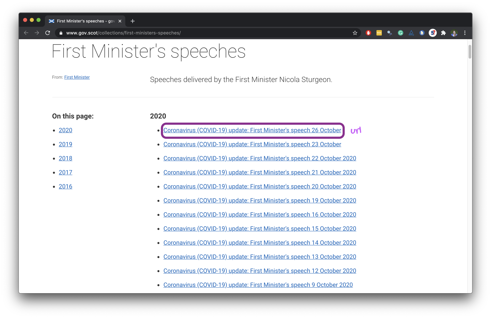
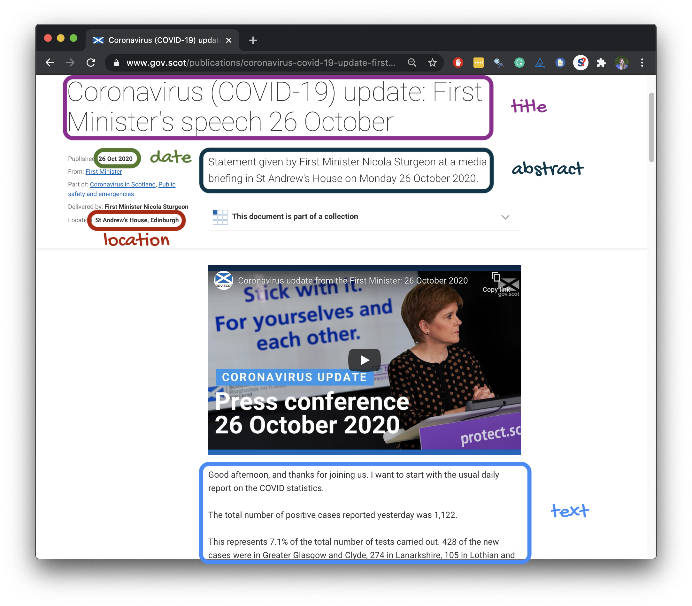

```{r setup, include=FALSE}
# R options
options(
  htmltools.dir.version = FALSE,
  dplyr.print_min = 6, 
  dplyr.print_max = 6,
  tibble.width = 65,
  width = 65
  )
# figure height, width, dpi
knitr::opts_chunk$set(echo = TRUE, 
                      fig.width = 8, 
                      fig.asp = 0.618,
                      out.width = "60%",
                      fig.align = "center",
                      dpi = 300,
                      message = FALSE)
# ggplot2
ggplot2::theme_set(ggplot2::theme_gray(base_size = 16))
# set seed
set.seed(1234)
# fontawesome
htmltools::tagList(rmarkdown::html_dependency_font_awesome())
# magick
dev.off <- function(){
  invisible(grDevices::dev.off())
}
# countdown
library(countdown)
# conflicted
library(conflicted)
conflict_prefer("filter", "dplyr")
# xaringanExtra
library(xaringanExtra)
xaringanExtra::use_panelset()
# output number of lines
hook_output <- knitr::knit_hooks$get("output")
knitr::knit_hooks$set(output = function(x, options) {
  lines <- options$output.lines
  if (is.null(lines)) {
    return(hook_output(x, options))  # pass to default hook
  }
  x <- unlist(strsplit(x, "\n"))
  more <- "..."
  if (length(lines)==1) {        # first n lines
    if (length(x) > lines) {
      # truncate the output, but add ....
      x <- c(head(x, lines), more)
    }
  } else {
    x <- c(more, x[lines], more)
  }
  # paste these lines together
  x <- paste(c(x, ""), collapse = "\n")
  hook_output(x, options)
})
```

```{r packages, echo=FALSE, message=FALSE, warning=FALSE}
library(tidyverse)
library(tidymodels)
library(scales)
```

## tidyverse 

.pull-left[
```{r echo=FALSE, out.width="80%"}
knitr::include_graphics("img/tidyverse.png")
```
]

.pull-right[
.center[.large[
[tidyverse.org](https://www.tidyverse.org/)
]]

- The **tidyverse** is an opinionated collection of R packages designed for data science
- All packages share an underlying philosophy and a common grammar
]

---

class: middle

```{r echo=FALSE, out.width="80%"}
knitr::include_graphics("img/tidyverse-packages.png")
```

---

## tidymodels

.pull-left[
```{r echo=FALSE, out.width="80%"}
knitr::include_graphics("img/tidymodels.png")
```
]

.pull-right[
.center[.large[
[tidymodels.org](https://www.tidymodels.org/)
]]

- The **tidymodels** framework is a collection of packages for modeling and machine learning using **tidyverse** principles.
- All packages share an underlying philosophy and a common grammar
]

---

class: middle

```{r echo=FALSE, out.width="80%"}
knitr::include_graphics("img/tidymodels-packages.png")
```

---

## Data science cycle

```{r echo=FALSE, out.width="80%"}
knitr::include_graphics("img/data-science.png")
```

.footnote[
[R for Data Science](https://r4ds.had.co.nz/introduction.html), Grolemund and Wickham.
]

---

class: middle

```{r echo=FALSE, out.width="70%"}
knitr::include_graphics("img/fm-speech-oct-26.png")
```

---

class: middle

# Import

---

## 🏁 Start with

```{r echo=FALSE, out.width="75%"}
knitr::include_graphics("img/fm-speeches.png")
```

---

## End with 🛑

```{r echo=FALSE}
covid_speeches_scot <- read_rds(here::here("data/covid-speeches-scot.rds"))
covid_speeches_scot %>%
  print(n = 15)
```

---

#### .center[
[www.gov.scot/collections/first-ministers-speeches](https://www.gov.scot/collections/first-ministers-speeches/)
]

```{r echo=FALSE, out.width="75%"}

```

---

```{r echo=FALSE, out.width="65%"}

```

---

## Plan: Get data from a single page

1. Scrape `title`, `date`, `location`, `abstract`, and `text` from a few COVID-19 speech pages to develop the code

2. Write a function that scrapes `title`, `date`, `location`, `abstract`, and `text` from COVID-19 speech pages

3. Scrape the `url`s of COVID-19 speeches from the main page

4. Use this function to scrape from each individual COVID-19 speech from these `url`s and create a data frame with the columns `title`, `date`, `location`, `abstract`, `text`, and `url`

---

## rvest

.pull-left[
- The **rvest** package makes basic processing and manipulation of HTML data straight forward
- It's designed to work with pipelines built with `%>%`
```{r}
library(rvest)
```

]
.pull-right[
```{r echo=FALSE,out.width=230,fig.align="right"}
knitr::include_graphics("img/rvest.png")
```
]

---

## Read page for 26 Oct speech

```{r}
url <- "https://www.gov.scot/publications/coronavirus-covid-19-update-first-ministers-speech-26-october/"
speech_page <- read_html(url)
```

.pull-left[
```{r}
speech_page
```
]
.pull-right[
```{r echo=FALSE, out.width="80%"}
knitr::include_graphics("img/fm-speech-oct-26.png")
```
]

---

## Extract title

.pull-left-wide[
<br><br>
```{r}
title <- speech_page %>%
    html_node(".article-header__title") %>%
    html_text()

title
```
]
.pull-right-narrow[
```{r echo=FALSE, out.width="100%"}
knitr::include_graphics("img/title.png")
```
]

---

## Extract date

.pull-left-wide[
```{r}
library(lubridate)

speech_page %>%
    html_node(".content-data__list:nth-child(1) strong") %>%
    html_text() 

date <- speech_page %>%
    html_node(".content-data__list:nth-child(1) strong") %>%
    html_text() %>%
    dmy()
date
```
]
.pull-right-narrow[
```{r echo=FALSE, out.width="100%"}
knitr::include_graphics("img/date.png")
```
]

---

## Similarly...

extract location, abstract, and text

---

## Put it all in a data frame

.pull-left[
```{r echo=FALSE}
location <- speech_page %>%
    html_node(".content-data__list+ .content-data__list strong") %>%
    html_text()

abstract <- speech_page %>%
    html_node(".leader--first-para p") %>%
    html_text()

text <- speech_page %>% 
    html_nodes("#preamble p") %>%
    html_text() %>%
    list()
```


```{r}
oct_26_speech <- tibble(
  title    = title,
  date     = date,
  location = location,
  abstract = abstract,
  text     = text,
  url      = url
)

oct_26_speech
```
]
.pull-right[
```{r echo=FALSE, out.width="75%"}
knitr::include_graphics("img/fm-speech-oct-26.png")
```
]

---

## Plan: Get data from all pages

- Write a function that scrapes the data from a single page and returns a data frame with a single row for that page

- Obtain a list of URLs of all pages

- Map the function over the list of all URLs to obtain a data framw where each row is a single speech and the number of rows is the number of speeches

```{r echo=FALSE}
covid_speeches_scot
```

---

## Write a function

.xsmall[
```{r}
scrape_speech_scot <- function(url){
  
  speech_page <- read_html(url)
  
  title <- speech_page %>%
    html_node(".article-header__title") %>%
    html_text()
  
  date <- speech_page %>%
    html_node(".content-data__list:nth-child(1) strong") %>%
    html_text() %>%
    dmy()
  
  location <- speech_page %>%
    html_node(".content-data__list+ .content-data__list strong") %>%
    html_text()
  
  abstract <- speech_page %>%
    html_node(".leader--first-para p") %>%
    html_text()
  
  text <- speech_page %>% 
    html_nodes("#preamble p") %>%
    html_text() %>%
    glue_collapse(sep = " ") %>%
    as.character()
  
  tibble(
    title    = title,
    date     = date,
    location = location,
    abstract = abstract,
    text     = text,
    url      = url
  )
  
}
```
]

---

## Get a list of all URLs

```{r}
all_speeches_page_scot <- read_html("https://www.gov.scot/collections/first-ministers-speeches/")

covid_speech_urls_uk_scot <- all_speeches_page_scot %>%
  html_nodes(".collections-list a") %>%
  html_attr("href") %>%
  str_subset("covid-19") %>%
  str_c("https://www.gov.scot", .)
```

---

## Map the function over all URLs

```{r eval=FALSE}
covid_speeches_scot <- map_dfr(covid_speech_urls_uk_scot, scrape_speech_scot)
```

```{r}
covid_speeches_scot
```

---

class: middle

# Transform and visualise

---

## Filter for First minister speeches

```{r}
covid_speeches_scot <- covid_speeches_scot %>%
  filter(str_detect(abstract, "First Minister"))

covid_speeches_scot
```

---

## Count number of words in each speech

```{r}
covid_speeches_scot <- covid_speeches_scot %>%
  rowwise() %>%
  mutate(n_words = text %>% str_count("\\w+") %>% sum()) %>%
  ungroup()

covid_speeches_scot
```

---

## Length of speech over time

.panelset[
.panel[.panel-name[Plot]
```{r words-over-time, echo=FALSE}
ggplot(covid_speeches_scot, aes(x = date, y = n_words)) +
  geom_point(alpha = 0.7) +
  geom_smooth(aes(x = date, y = n_words), method = lm, formula = y ~ x) +
  labs(
    title = "Length of Scotland COVID-19 speeches",
    subtitle = "Measured in number of words"
  )
```

]

.panel[.panel-name[R Code]
```{r ref.label="words-over-time", fig.show='hide'}
```
]
]

---

## Length of speech over time, again

.panelset[
.panel[.panel-name[Plot]
```{r words-over-time-better, echo = FALSE}
# set color: https://www.schemecolor.com/flag-of-scotland-colors.php
scotblue <- "#0065BF" #<<

covid_speeches_scot %>%
  ggplot(aes(x = date, y = n_words)) +
  geom_point(alpha = 0.7, color = scotblue) + #<<
  geom_smooth(aes(x = date, y = n_words), method = lm, formula = y ~ x,  color = "darkgray") + #<<
  labs(
    title = "Length of Scotland COVID-19 speeches over time",
    subtitle = "Measured in number of words",
    x = NULL,  #<<
    y = "Number of words" #<<
  ) +
  theme_minimal() #<<
```
]

.panel[.panel-name[R Code]
```{r ref.label="words-over-time-better", fig.show='hide'}
```
]
]

---

## tidytext

.pull-left[
- Using tidy data principles can make many text mining tasks easier, more effective, and consistent with tools already in wide use
- Learn more at [tidytextmining.com](https://www.tidytextmining.com/)
```{r}
library(tidytext)
```

]
.pull-right[
```{r echo=FALSE, fig.align = "left"}
knitr::include_graphics("img/tidytext.png")
```
]

---

## Tokenize speeches by word

.panelset[
.panel[.panel-name[Plot]
```{r tokenize-scot-word, echo = FALSE}
covid_speeches_scot_words <- covid_speeches_scot %>%
  # make sure COVID-19 (and all its various spellings) don't get split
  # tidytext doesn't remove underscores
  # https://stackoverflow.com/questions/58281091/preserve-hyphenated-words-in-ngrams-analysis-with-tidytext
  mutate(
    text = str_replace_all(text, "COVID-19", "COVID_19"),
    text = str_replace_all(text, "COVID 19", "COVID_19"),
    text = str_replace_all(text, "Covid-19", "COVID_19"),
    text = str_replace_all(text, "Covid 19", "COVID_19")
  ) %>%
  unnest_tokens(word, text) %>%
  relocate(date, word)

covid_speeches_scot_words
```
]

.panel[.panel-name[R Code]
```{r ref.label="tokenize-scot-word", results="hide"}
```
]
]

---

## Find common words

.panelset[
.panel[.panel-name[Plot]
```{r scot-common-words, echo=FALSE}
covid_speeches_scot_words %>%
  anti_join(stop_words) %>%
  count(word, sort = TRUE) %>%
  slice_head(n = 15) %>%
  ggplot(aes(y = fct_reorder(word, n), x = n, fill = log(n))) +
  geom_col(show.legend = FALSE) +
  labs(
    title = "Commonly used words in Scotland COVID-19 briefings",
    y = NULL, x = "Frequency"
  ) +
  theme_minimal()
```

]

.panel[.panel-name[R Code]
```{r ref.label="scot-common-words", fig.show='hide'}
```
]
]

---

## Social vs. physical distancing

.panelset[
.panel[.panel-name[Plot]
```{r social-physical, echo=FALSE}
covid_speeches_scot %>%
  unnest_tokens(bigram, text, token = "ngrams", n = 2) %>%
  filter(str_detect(bigram, "social dist|physical dist")) %>%
  mutate(soc_phys = if_else(str_detect(bigram, "social"), "S", "P")) %>%
  count(date, soc_phys) %>%
  ggplot(aes(x = date, y = n, color = soc_phys)) +
  geom_text(aes(label = soc_phys)) +
  guides(color = FALSE) +
  labs(x = "Date", y = "Frequency",
       title = "Social (S) vs. physical (P) distancing",
       subtitle = "Number of mentions over time") +
  scale_color_manual(values = c(scotblue, "darkgray")) +
  scale_y_continuous(limits = c(0, 10), breaks = seq(0, 10, 2)) +
  theme_minimal()
```

]

.panel[.panel-name[R Code]
```{r ref.label="social-physical", fig.show='hide'}
```
]
]

---

## Vaccines

.panelset[
.panel[.panel-name[Plot]
```{r vaccines, echo=FALSE, dev="ragg_png"}
covid_speeches_scot_words %>%
  filter(str_detect(word, "[Vv]accin")) %>%
  count(date) %>%
  ggplot(aes(x = date, y = n)) +
  geom_text(aes(label = "💉", size = n), show.legend = FALSE) +
  labs(x = "Date", y = "Frequency",
       title = 'Number of times "vaccine" is mentioned in speech') +
  theme_minimal()
```

]

.panel[.panel-name[R Code]
```{r ref.label="vaccines", fig.show='hide'}
```
]
]

---

## Compare to UK

```{r echo=FALSE, out.width = "85%"}
ukred <- "#D00C27"

covid_speeches_words <- read_rds(here::here("processed-data", "covid-speeches-words.rds"))

covid_speeches_tf_ifd <- covid_speeches_words %>%
  count(origin, word, sort = TRUE) %>%
  group_by(origin) %>%
  mutate(total = sum(n)) %>%
  bind_tf_idf(word, origin, n)

covid_speeches_tf_ifd %>%
  arrange(desc(tf_idf)) %>%
  mutate(word = factor(word, levels = rev(unique(word)))) %>% 
  group_by(origin) %>% 
  slice_head(n = 15) %>% 
  ungroup() %>%
  ggplot(aes(y = word, x = tf_idf, fill = origin)) +
  geom_col(show.legend = FALSE) +
  labs(y = NULL, x = "tf-idf", title = "Common words in COVID briefings") +
  facet_wrap(~origin, ncol = 2, scales = "free") +
  scale_fill_manual(values = c(scotblue, ukred)) +
  scale_x_continuous(breaks = c(0, 0.00015, 0.0003), labels = label_number()) +
  theme_minimal()
```

---

class: middle

# Model

---

## Predicting UK vs. Scotland

```{r echo=FALSE}
covid_speeches_scot <- read_rds(here::here("data/covid-speeches-scot.rds")) %>%
  mutate(origin = "Scotland") %>%
  select(-location, -title, -abstract) %>%
  rownames_to_column(var = "speech_id")
  
covid_speeches_uk <- read_rds(here::here("data/covid-speeches-uk.rds")) %>%
  mutate(origin = "UK") %>%
  select(-title, -abstract) %>%
  rownames_to_column(var = "speech_id")

covid_speeches <- bind_rows(covid_speeches_scot, covid_speeches_uk) %>%
  mutate(origin = as.factor(origin)) %>%
  select(-url)
```

```{r}
covid_speeches %>%
  count(origin)
```

---

## Tokenize into sentences

```{r}
covid_speeches_sentences <- covid_speeches %>%
  unnest_tokens(sentence, text, token = "sentences")

covid_speeches_sentences %>%
  relocate(sentence)
```

---

## Split into testing and training

```{r}
set.seed(1234)
covid_split <- initial_split(covid_speeches_sentences, strata = origin)
covid_train <- training(covid_split)
covid_test  <- testing(covid_split)
```

---

## Specify a model

```{r}
lasso_mod <- logistic_reg(penalty = 0.005, mixture = 1) %>%
  set_engine("glmnet")
```

---

## Build a recipe

```{r}
library(textrecipes)

covid_rec <- recipe(origin ~ sentence, data = covid_train) %>%
  # tokenize into words
  step_tokenize(sentence, token = "words") %>%
  # filter out stop words
  step_stopwords(sentence) %>%
  # all the 1-grams followed by all the 2-grams followed by all the 3-grams
  step_ngram(sentence, num_tokens = 3, min_num_tokens = 1) %>%
  # keep the 500 most frequent words to avoid creating too many variables 
  step_tokenfilter(sentence, max_tokens = 500) %>%
  # calculate tf-idf
  step_tfidf(sentence)
```

---

## Build a workflow

```{r}
covid_wflow <- workflow() %>%
  add_model(lasso_mod) %>%
  add_recipe(covid_rec)
```

---

## Perform cross-validation

```{r echo=FALSE}
covid_folds <- read_rds(here::here("model-output", "covid_folds.rds"))
```


```{r eval=FALSE}
set.seed(1234)
covid_folds <- vfold_cv(covid_train, v = 10, strata = origin)
```

```{r}
covid_folds
```


---

## Fit resamples

```{r echo=FALSE}
covid_fit_rs <- read_rds(here::here("model-output", "covid_fit_rs.rds"))
```


```{r eval=FALSE}
covid_fit_rs <- covid_wflow %>%
  fit_resamples(
    covid_folds,
    control = control_resamples(save_pred = TRUE)
  )
```

```{r}
covid_train_metrics <- collect_metrics(covid_fit_rs)
covid_train_metrics
```

---

## ROC curve

.small[
```{r}
covid_train_pred <- collect_predictions(covid_fit_rs)

covid_train_pred %>%
  group_by(id) %>%
  roc_curve(truth = origin, .pred_Scotland) %>%
  autoplot() +
  labs(
    title = "ROC curve for Scotland & UK COVID speeches",
    subtitle = "Each resample fold is shown in a different color"
  )
```
]

---

## Make predictions for test data

```{r warning=FALSE}
covid_fit <- covid_wflow %>%
  fit(data = covid_train)

covid_test_pred <- predict(covid_fit, new_data = covid_test, type = "prob") %>%
  bind_cols(covid_test %>% select(origin, speech_id, sentence))

covid_test_pred
```

---

## ROC curve

```{r}
covid_test_pred %>%
  roc_curve(truth = origin, .pred_Scotland) %>%
  autoplot()
```

---

## View predictions

```{r}
covid_test_pred %>%
  roc_auc(truth = origin, .pred_Scotland)

covid_test_pred %>% 
  filter(origin == "Scotland", .pred_UK > 0.5)
```

---

## What decisions did we make?

without thinking about it much...

- `step_tokenfilter(sentence, max_tokens = 500)` -- why 500 for max_tokens?
- `logistic_reg(penalty = 0.005, mixture = 1)` -- why 0.005 for penalty?

---

## Tuning

### Specify model

```{r}
## with penalty ??
lasso_mod_tune <- logistic_reg(penalty = tune(), mixture = 1) %>%
  set_engine("glmnet") %>% 
  set_mode("classification")
```

---

## Tuning

### Build recipe

```{r}
covid_rec_tune <- recipe(origin ~ sentence, data = covid_train) %>%
  step_tokenize(sentence, token = "words") %>%
  step_stopwords(sentence) %>%
  step_ngram(sentence, num_tokens = 3, min_num_tokens = 1) %>%
  # keep the ?? most frequent words to avoid creating too many variables 
  step_tokenfilter(sentence, max_tokens = tune(), min_times = 5) %>%
  step_tfidf(sentence)
```

---

## Tuning

### Build workflow

```{r}
covid_wflow_tune <- workflow() %>%
  add_model(lasso_mod_tune) %>%
  add_recipe(covid_rec_tune)
```

---

## Tuning

### Possible set of hyperparameters

```{r}
param_grid <- grid_regular(
  penalty(range = c(-4, 0)),
  max_tokens(range = c(500, 2000)),
  levels = 5
)

param_grid
```

---

## Tuning

### Train models with all possible set of hyperparameters

```{r eval=FALSE}
set.seed(24)
covid_fit_rs_tune <- tune_grid(
  covid_wflow_tune,
  resamples = covid_folds,
  grid = param_grid, 
  control = control_grid(save_pred = TRUE)
)
```

---

## Tuning 

### Results

```{r echo=FALSE}
covid_fit_rs_tune <- read_rds(here::here("model-output", "covid_fit_rs_tune.rds"))
```

```{r}
covid_fit_rs_tune
```

---

## Tuning

### Select best

```{r}
best_roc_auc <- select_best(covid_fit_rs_tune, "roc_auc")

best_roc_auc

covid_wflow_final <- finalize_workflow(covid_wflow_tune, best_roc_auc)
```

---

## Variable importance

```{r echo=FALSE}
vi_data <- read_rds(here::here("model-output", "vi_data.rds"))
```

```{r eval=FALSE}
library(vip)

vi_data <- covid_wflow_final %>%
  fit(covid_train) %>%
  pull_workflow_fit() %>%
  vi(lambda = best_roc_auc$penalty) %>%
  mutate(Variable = str_remove_all(Variable, "tfidf_sentence_")) %>%
  filter(Importance != 0)
```

```{r}
vi_data
```

---

## Variable importance, visualised

.panelset[
.panel[.panel-name[Plot]
```{r vip, echo=FALSE}
vi_data %>%
  mutate(Importance = abs(Importance)) %>%
  filter(Importance != 0) %>%
  group_by(Sign) %>%
  slice_head(n = 20) %>%
  ungroup() %>%
  mutate(pred_origin = if_else(Sign == "POS", "UK", "Scotland")) %>% 
  ggplot(aes(x = Importance, y = fct_reorder(Variable, Importance), fill = pred_origin )) +
  geom_col(show.legend = FALSE) +
  scale_x_continuous(expand = c(0, 0)) +
  scale_fill_manual(values = c(scotblue, ukred)) +
  facet_wrap(~pred_origin, scales = "free") +
  labs(y = NULL) +
  theme_minimal()
```

]

.panel[.panel-name[R Code]
```{r ref.label="vip", fig.show='hide'}
```
]
]

---

## Prediction

```{r echo=FALSE}
scot_sentence <- covid_train %>%
  filter(origin == "Scotland", str_detect(sentence, "physical")) %>%
  slice(2)
```

.small[
```{r}
scot_sentence$sentence

scot_sentence %>%
  tidytext::unnest_tokens(words, sentence) %>%
  left_join(vi_data, by = c("words" = "Variable")) %>%
  mutate(pred_origin = if_else(Sign == "NEG", "Scotland", "UK")) %>%
  print(n = 25)
```
]

---

## Prediction

```{r echo=FALSE}
uk_sentence <- covid_train %>%
  filter(origin == "UK", str_detect(sentence, "scotland")) %>%
  slice(2)
```

.small[
```{r}
uk_sentence$sentence

uk_sentence %>%
  tidytext::unnest_tokens(words, sentence) %>%
  left_join(vi_data, by = c("words" = "Variable")) %>%
  mutate(pred_origin = if_else(Sign == "NEG", "Scotland", "UK")) %>%
  print(n = 25)
```
]

---

## Acknowledgements & learn more

- Read the full case study, with code: https://github.com/mine-cetinkaya-rundel/fm-speeches-covid19

- Learn tidyverse: https://www.tidyverse.org/learn

- Learn tidymodels: https://www.tidymodels.org/learn

- Much of this was inspired by Julia Silge and Emil Hvitfeldt's useR tutorial: 

https://emilhvitfeldt.github.io/useR2020-text-modeling-tutorial
